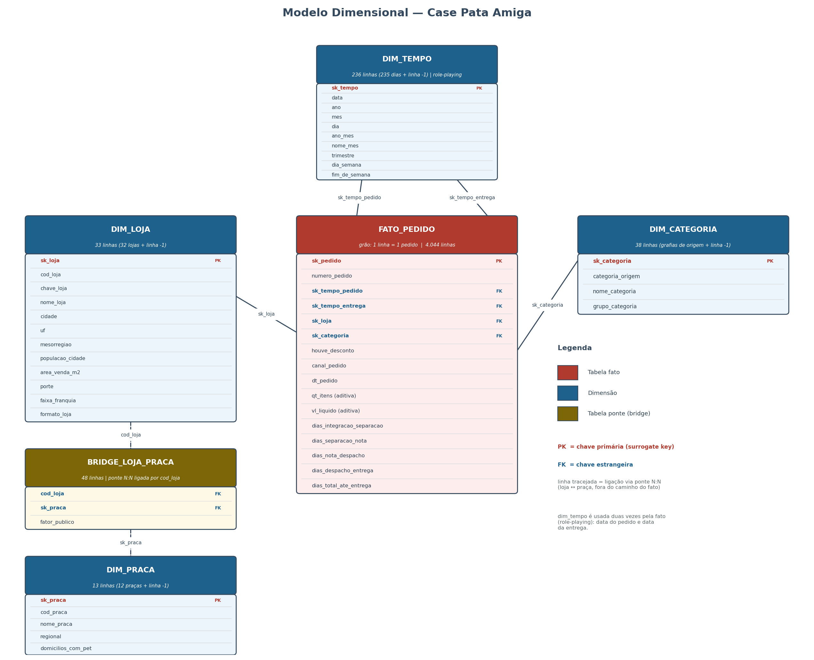
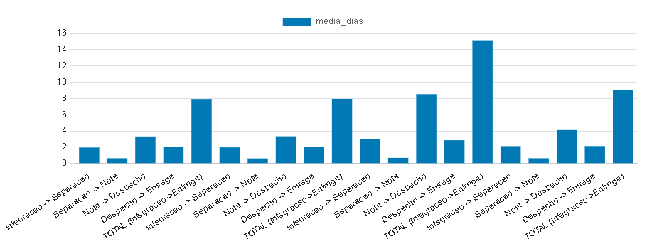
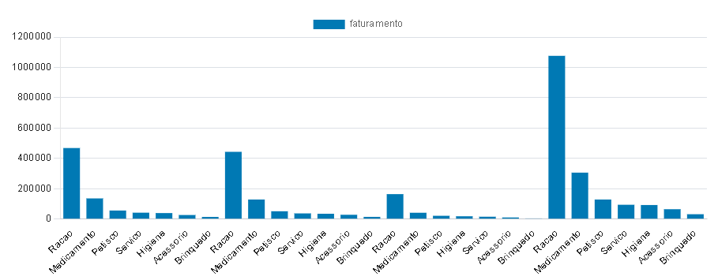
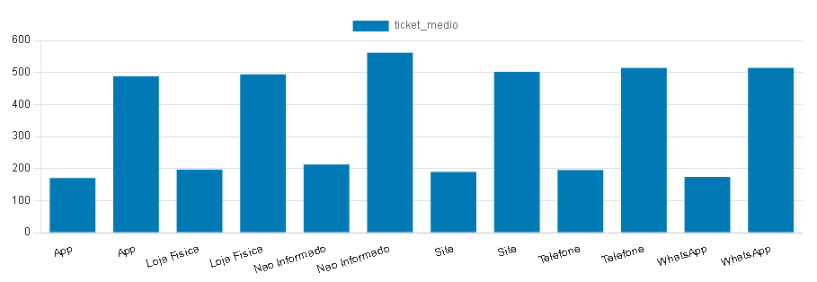
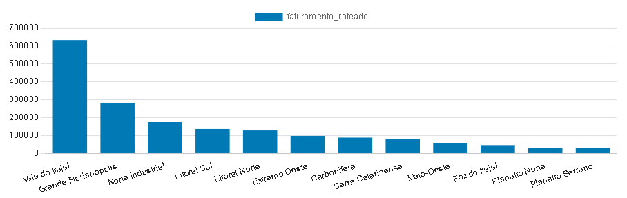
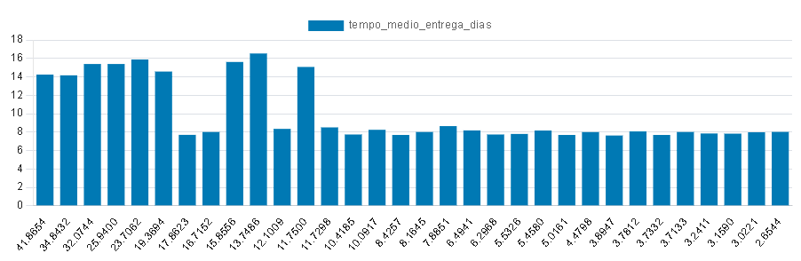
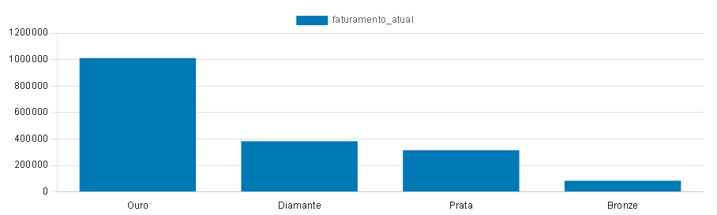
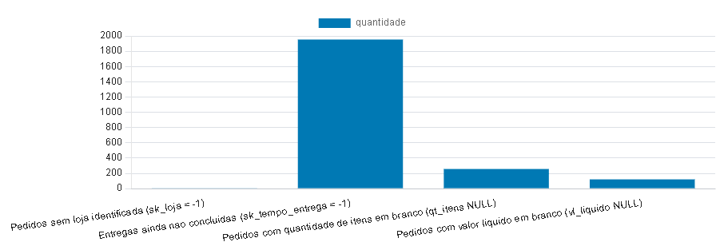

# 🐶Pata Amiga — Análise de Dados, Modelo Dimensional e Data Werehouse

#### 📖 1. Contextualização do Projeto

O projeto **Pata Amiga** consiste na construção de um **Data Warehouse em modelo estrela (Star Schema)** para consolidar e analisar os dados de vendas de uma rede de petshops que atua em múltiplas lojas físicas e canais de atendimento (App, Site, WhatsApp, Loja Física e Telefone).

Os dados de origem chegam em três tabelas de **staging** (`stg_pedido`, `stg_loja`, `stg_loja_praca`), extraídas de sistemas operacionais distintos e sem qualquer padronização prévia. Essa origem heterogênea traz problemas típicos de dados brutos que precisaram de tratamento ao longo do projeto, entre eles:

* **Grafias inconsistentes** em campos categóricos (ex.: 37 variações distintas de categoria de produto, que precisaram ser reclassificadas em 7 categorias-negócio padronizadas);
* **Nomes de loja com pequenas divergências de digitação** entre a base de pedidos e o cadastro de lojas, exigindo tratamento de acentuação, abreviações e grafia para o *matching* correto;
* **Datas em máscara americana** (`MM/DD/YYYY`), que exigiram atenção especial na conversão para tipos de data válidos no PostgreSQL, sob risco de erro de parsing;
* **Marcos do processo logístico incompletos** (datas de separação, nota fiscal, despacho e entrega em branco), representando etapas do pedido ainda em andamento, tratadas como `NULL` em vez de erro;
* **Pedidos sem loja ou sem código de loja vinculado** (~39% dos registros), que precisaram de uma estratégia de fallback (linha "Não Informado", `sk = -1`) para não comprometer a integridade referencial do modelo.

A partir dessa base, foi modelado um esquema estrela com uma tabela fato central — **`fato_pedido`**, no grão de um pedido por linha — e **quatro dimensões de apoio** (`dim_tempo`, `dim_loja`, `dim_categoria`, `dim_praca`) mais uma **tabela ponte** (`bridge_loja_praca`) para representar a relação N:N entre lojas e praças de atendimento, com rateio proporcional de público via `fator_publico`.

O objetivo final do projeto é permitir respostas de negócio confiáveis sobre gargalos logísticos, concentração de faturamento por categoria, efeito do desconto por canal, rateio de faturamento por praça e onde priorizar a expansão da rede — todas dependentes de uma carga e transformação de dados feita de maneira rigorosa, validada em cada etapa por um conjunto de consultas de conferência (`00-conferencia.sql`).

## 🔍 2. Diagnóstico da Origem (Tarefa 1)

### 2.1 Volumetria dos Dados Brutos

- **stg_pedido:** 4044 linhas carregadas.
- **stg_loja:** 32 linhas carregadas.
- **stg_loja_praca:** 48 linhas carregadas.

### 2.2 Análise de Qualidade e Inconsistências (Data Quality)

- **Variações de Grafia (Categorias):** Foram encontradas **37** grafias distintas na Staging para representar apenas 7 categorias oficiais (ex: misturas de acentuação, maiúsculas/minúsculas e abreviações como 'Rac.').
- **Variações de Grafia (Canais de Venda):** **20** variações encontradas (ex.: `App`, `APP`, `App Pata Amiga`, `app`; `Whatsapp`, `WHATSAPP`, `WhatsApp`, `whatsapp`; `Loja Física`, `LOJA FISICA`, `loja fisica`; `Tel.`, `Telefone`, `TELEFONE`, `telefone`; além de registros em branco).
- **Variações de Grafia (Status de Desconto):** **17** variações encontradas, misturando `S`, `SIM`, `Sim`, `sim`, `1`, `V`, `X` (indicando "houve desconto") com `N`, `NAO`, `Nao`, `Não`, `nao`, `0`, `F`, `false`, `true` e registros em branco.
- **Ausência de Chaves Naturais (Código de Loja):** **1.575 pedidos (~39%)** vieram com o campo `Cod Loja` completamente em branco, obrigando o mapeamento e amarração posterior na Fato através do nome da loja (`Loja-Nome`).
- **Registros Órfãos de Localização:** **3 pedidos** vieram sem nenhum nome de loja preenchido, mapeados preventivamente para a chave `-1` (Não Informado) para evitar perda de dados de faturamento.

### 2.3 Marcos de Processo em Aberto (Valores em Branco)

Os campos em branco refletem transações comerciais que ainda não passaram por todas as etapas logísticas:

- **Aguardando Separação de Estoque:** 1.077 processos em aberto.
- **Aguardando Emissão de Nota Fiscal:** 1.338 processos em aberto.
- **Aguardando Despacho com a Transportadora:** 1.665 processos em aberto.
- **Aguardando Entrega Final ao Cliente:** 1.953 processos em aberto.

## 📐 3. Modelo Dimensional (Arquitetura)

- **Grão da Tabela Fato:** 1 linha = 1 pedido (4.044 linhas no total).
- **Dimensões:** `dim_tempo`, `dim_loja`, `dim_categoria`, `dim_praca`.
- **Tabela ponte:** `bridge_loja_praca` — resolve a relação N:N entre loja e praça de atendimento, com o `fator_publico` como peso de rateio.
- Toda dimensão possui a linha `-1` ("Não Informado"), garantindo que nenhuma FK da fato fique nula mesmo quando o dado de origem está ausente.

## ⚙️ 4. Pipeline de ETL e Decisões de Tratamento (Tarefa 2 e 3)

- 📅 Máscaras e conversão de datas (Formato americano vs Processo)
- 🔢 Regra dos números (Tratamento de nulos e valores monetários)
- 🏷️ Ordem lógica do De-Para de categorias (Precedência de Ração Medicamentosa)
- 🏪 Padronização de nomes de lojas e canais (WhatsApp antes de App)

## 💡 5. Respostas Práticas de Negócio (Tarefa 5)

Todas as consultas desta seção são executadas pelo arquivo **`05-respostas-negocio.sql`**, que deve rodar depois dos arquivos 01 a 04.

- **🚚 P1 (Onde está o gargalo da entrega?):** tempo médio, em dias, entre a integração do pedido no ERP e a entrega ao cliente; identificação de qual dos quatro intervalos do processo (Integração → Separação, Separação → Nota, Nota → Despacho, Despacho → Entrega) é o mais lento; e verificação se esse gargalo se repete nos três portes de loja (Pequena, Média, Grande).

- **💰 P2 (Qual categoria concentra o faturamento?):** faturamento e percentual do total por categoria padronizada (`nome_categoria`, nunca pela grafia crua), e checagem se a categoria campeã se mantém a mesma nos três portes de loja.

- **🎟️ P3 (O desconto funciona igual em todo canal?):** comparação do ticket médio COM e SEM desconto dentro de cada canal de venda (App, Site, Loja Física, Telefone, WhatsApp), além da participação de cada canal no faturamento total da rede.

- **📍 P4 (Qual praça de atendimento concentra o faturamento?):** faturamento rateado por praça através do `fator_publico` da tabela ponte `bridge_loja_praca` (uma loja pode atender mais de uma praça), cruzado com o número de domicílios com pet de cada praça; inclui checagem de que a soma rateada fecha com o faturamento da rede.

- **🔮 P5 (Onde abrir a próxima loja, e o que os dados NÃO permitem afirmar?):**
- **Análise dos Dados:** O cruzamento do volume de itens vendidos por mil habitantes com o tempo médio de entrega revela quais praças possuem alta demanda reprimida ou severas deficiências logísticas. Cidades com alto consumo per capita e lead time de entrega elevado são candidatas ideais para a abertura de uma nova filial física, reduzindo custos de frete e melhorando o nível de serviço (SLA). Para a estratégia de expansão da rede, as praças localizadas nos picos mais altos de tempo de entrega representam uma  **oportunidade de ouro para a abertura de novas lojas físicas**. Estabelecer um ponto de venda ou um mini-hub de distribuição nessas regiões converteria o frete de longa distância em uma entrega local. Isso reduziria drasticamente o *lead time* (de ~16 dias para menos de 24h), melhoraria a experiência do cliente e capturaria uma fatia de mercado altamente reprimida pela demora atual.

#### 🗺️ P5a Análise de Dispersão e Eficiência Logística por Praça

* **Zonas de Gargalo Crítico (Altos Prazos):** No lado esquerdo do gráfico, observa-se um grupo de praças com tempos médios de entrega muito elevados, oscilando **entre 14 e mais de 16 dias** para a conclusão do ciclo logístico. O fato de esses prazos longos coexistirem em regiões com dinâmicas de vendas variadas indica falhas estruturais de transporte, grandes distâncias geográficas do centro de distribuição ou problemas crônicos na última milha ( *last mile* **).**
* **Zonas de Estabilização Operacional:** À medida que avançamos para a direita, o modelo logístico demonstra uma forte tendência de padronização. A grande maioria das praças estabiliza seu tempo de atendimento em um patamar previsível de  **aproximadamente 8 dias** **. Essa consistência sugere que a operação logística possui um processo maduro e replicável para esse perfil de localidade.**

#### 🏆 P5b (Faturamento por Faixa de Franquia Atual)

* **Análise dos Dados:** Esta visão consolida o faturamento do período agrupado pela classificação atual das lojas (Ex: Ouro, Prata, Bronze). Ela demonstra o peso de cada faixa de performance no resultado global da empresa no momento presente.

#### ⚠️ P5c (Limitações Técnicas: O que os dados NÃO permitem afirmar?)

* **Análise dos Dados:** Do ponto de vista analítico, o cadastro atual é uma "foto" estática e não guarda histórico (SCD Tipo 1). Portanto,  **não é possível afirmar quanto do faturamento histórico veio de lojas que já eram 'Ouro' na data do pedido** **. Se uma loja era Bronze no ano passado e virou Ouro hoje, todas as suas vendas passadas serão contabilizadas incorretamente na faixa Ouro. Além disso, a análise omite cerca de 39% dos pedidos que não possuem loja identificada na origem, além de pedidos com valores zerados ou entregas ainda não concluídas.**

## 🎯 6. Recomendação Final e Leitura Crítica

#### 📊 Recomendações de Negócio

1. **Foco na Categoria Campeã:** Direcionar esforços de trade marketing e negociação com fornecedores para a categoria de maior concentração de faturamento identificada na  **P2** **, garantindo abastecimento contínuo e margens otimizadas.**
2. **Otimização de Canais e Descontos:** Avaliar a eficiência das campanhas promocionais na  **P3** **. Se canais como o WhatsApp apresentarem ticket médio muito menor com desconto sem um ganho expressivo de volume, a política de concessão de margem deve ser revista para esse ponto de contato.**
3. **Plano de Expansão Logística:** Priorizar a abertura de novas lojas em praças que demonstrem alto volume de domicílios com pets (dados da  **P4** **) e que atualmente sofram com gargalos de entrega (dados da ** **P1** **), capturando mercado da concorrência pela conveniência e velocidade.**

#### 🛠️ Leitura Crítica do Data Warehouse (Pontos de Atenção)

* **Fraca Rastreabilidade Histórica (Falta de SCD):** A ausência de dimensões de variação lenta (SCD Tipo 2) no cadastro de lojas impede uma análise real de evolução de performance por faixa de franquia. Recomenda-se refatorar a `dim_loja` para armazenar o histórico de alterações de categoria das lojas.
* **Vulnerabilidade na Origem (Data Quality):** A dependência do campo textual `Loja-Nome` para associar ~39% dos pedidos à dimensão correta (devido à ausência de `Cod Loja`) acende um alerta crítico para a equipe de sistemas operacionais. É imperativo tornar o código de identificação da loja um campo obrigatório no sistema de vendas.
* **Volume Significativo de Dados Omitidos:** Análises preditivas ou de receita total devem considerar que os dados "Não Informados" (chave `-1`) mitigam o erro de integridade do DW, mas mascaram problemas operacionais crônicos na coleta de dados de quase 2/5 da operação.

## 🚀 7. Instruções para Reprodução (Ordem de Execução dos Scripts)

1. `01-carga-staging.sql` -> Usar via terminal; dentro do PGAdmin abra o PSQL Tool. Se aparecer o prompt "postgres-#", digite o comando "\q" seguido de "Enter". Localize o arquivo `01-carga-staging.sql` no seu computador e execute o comando a seguir: `psql -U postgres -d postgres -f 01-carga-staging.sql`. Caso ocorra um erro referente a codificação "WIN1252", execute o seguinte comandoa seguir:
   `(echo SET client_encoding TO 'WIN1252'; & type 01-carga-staging.sql) | psql -U postgres -d postgres`
2. `02-dimensoes-construidas.sql`
3. `03-construir-dimensoes.sql`
4. `04-fato-pedido.sql`
5. `05-respostas-negocio.sql`

Depois de cada etapa, rode o bloco correspondente do `00-conferencia.sql` (identificado pelos comentários "DEPOIS DO 01", "DEPOIS DO 02" etc.) para validar os números antes de seguir para o próximo arquivo.

## 🎥 8. Vídeo de Demonstração

[Link do vídeo gravado para Apresentação: [drive.google.com/file/d/1qNxGXYVrB_F6U9Sx6_SZbAbNqz3L1j8Y/view?usp=sharing](https://drive.google.com/file/d/1qNxGXYVrB_F6U9Sx6_SZbAbNqz3L1j8Y/view?usp=sharing)]
